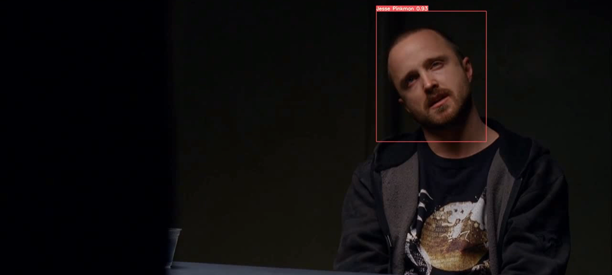
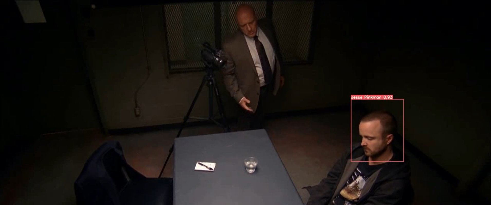
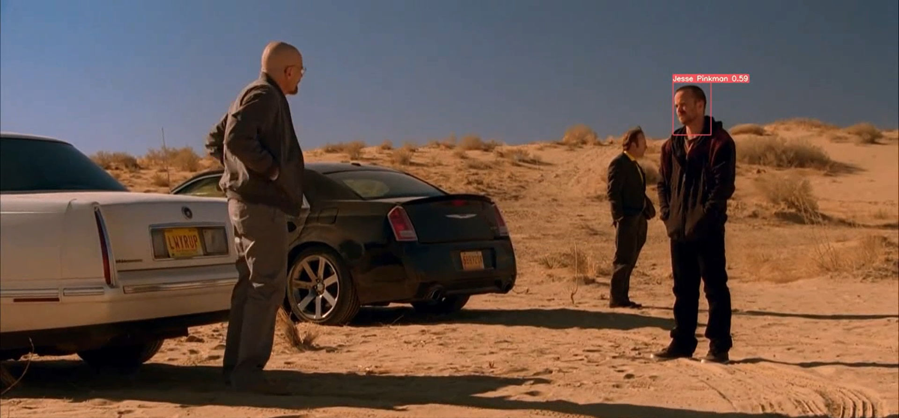
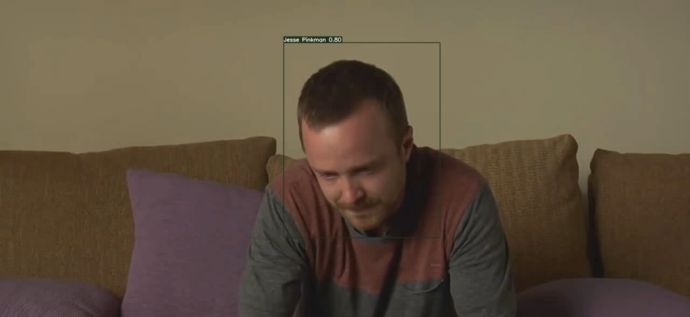

# Jesse-Pinkman-in-Breaking-Bad-Detection-and-Tracking-using-YOLOv7

New Computer Vision project.

Jesse Pinkman in Breaking Bad Detection & Tracking using YOLO v7 Algorithm.

===========================================================================

Jesse Pinkman is one of the best characters in the history of movies and series. Noone doesn't love Jesse Pinkman.
So, we will do our ptoject for him.

Video Link: https://drive.google.com/file/d/1b9EkXpIe88FPChibsv_dv-Zdf4nEoZ-R/view?usp=share_link

==========================================================================

A brief about the notebook:

1-Creating Directory

2-Cloning YoloV7 Repository

3-Unzipping Data

4-Checking for GPU

5-Downloading Weights

6-Training YOLO

7-Detection

8-Zipping the whole project

===========================================================================

Some Screenshots:

.png)

